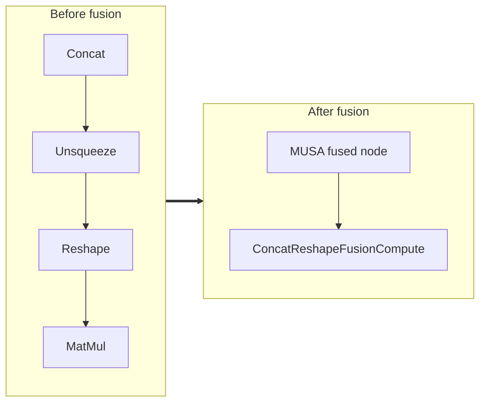

<!-- AUTO-GENERATED by scripts/gen_fusion_docs.py. DO NOT EDIT BY HAND. -->
# Concat Reshape Fusion

This file is generated from the current C++ fusion source and matching fusion tests. The before graph prefers ONNX topology extracted from test cases, then falls back to finder source analysis; no per-fusion prose metadata is maintained by the generator.

## Source Mapping

- GetCapability priority: **20**
- Finder: `FindConcatReshapeFusions`
- Finder implementation: `musa/ep/src/fusion/concat_reshape_fusion_matcher.cc`
- Compile detector: `IsConcatReshapeFusionGraph`
- Runtime factory: `CreateConcatReshapeFusion`
- Runtime compute: `ConcatReshapeFusionCompute`
- Runtime implementation: `musa/ep/src/fusion/concat_reshape_fusion.cc`
- `drop_constant_initializers`: `true`
- Before-graph topology source: `test/fusion/test_concat_reshape_fusion.py::test_concat_unsqueeze_reshape_fusion`

## Extracted ONNX Ops

`Reshape`, `Unsqueeze`, `Concat`

## Mermaid

