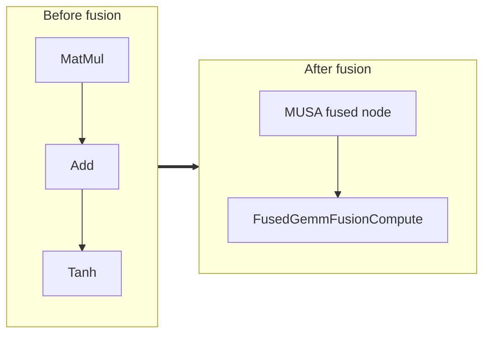

<!-- AUTO-GENERATED by scripts/gen_fusion_docs.py. DO NOT EDIT BY HAND. -->
# Fused Gemm Fusion

This file is generated from the current C++ fusion source and matching fusion tests. The before graph prefers ONNX topology extracted from test cases, then falls back to finder source analysis; no per-fusion prose metadata is maintained by the generator.

## Source Mapping

- GetCapability priority: **27**
- Finder: `FindFusedGemmFusions`
- Finder implementation: `musa/ep/src/fusion/linear_fusion_matcher.cc`
- Compile detector: `IsFusedGemmFusionGraph`
- Runtime factory: `CreateFusedGemmFusion`
- Runtime compute: `FusedGemmFusionCompute`
- Runtime implementation: `musa/ep/src/fusion/linear_fusion.cc`
- `drop_constant_initializers`: `false`
- Before-graph topology source: `test/fusion/test_fused_gemm_fusion.py::test_matmul_add_tanh_fusion`

## Extracted ONNX Ops

`MatMul`, `Add`, `Relu`, `LeakyRelu`, `Tanh`, `Sigmoid`

## Mermaid

