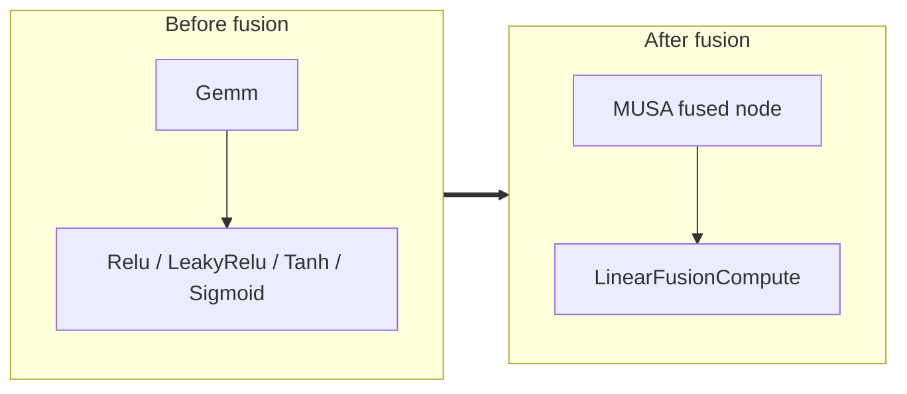

<!-- AUTO-GENERATED by scripts/gen_fusion_docs.py. DO NOT EDIT BY HAND. -->
# Gemm + Activation Fusion

This file is generated from the current C++ fusion source. The before graph is derived from ONNX op names found in the finder/detector source; no per-fusion prose metadata is maintained by the generator.

## Source Mapping

- GetCapability priority: **7**
- Finder: `FindGemmActivationFusions`
- Compile detector: `IsLinearFusionGraph`
- Runtime factory: `CreateLinearFusion`
- Runtime compute: `LinearFusionCompute`
- Runtime implementation: `musa/ep/src/fusion/linear_fusion.cc`
- `drop_constant_initializers`: `false`

## Extracted ONNX Ops

`Gemm`, `Relu`, `LeakyRelu`, `Tanh`, `Sigmoid`

## Mermaid

