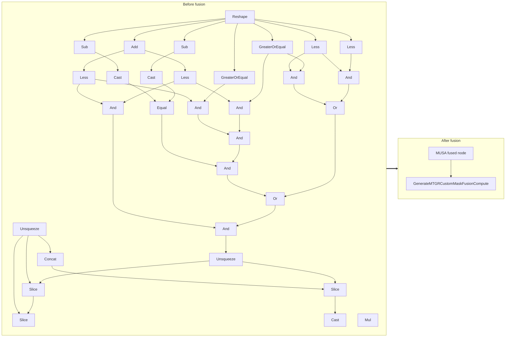

<!-- AUTO-GENERATED by scripts/gen_fusion_docs.py. DO NOT EDIT BY HAND. -->
# Generate MTGR Custom Mask Fusion

This file is generated from the current C++ fusion source and matching fusion tests. The before graph prefers ONNX topology extracted from test cases, then falls back to finder source analysis; no per-fusion prose metadata is maintained by the generator.

## Source Mapping

- GetCapability priority: **4**
- Finder: `FindGenerateMTGRCustomMaskFusions`
- Finder implementation: `musa/ep/src/fusion/generate_mtgr_custom_mask_fusion_matcher.cc`
- Compile detector: `IsGenerateMTGRCustomMaskFusionGraph`
- Runtime factory: `CreateGenerateMTGRCustomMaskFusion`
- Runtime compute: `GenerateMTGRCustomMaskFusionCompute`
- Runtime implementation: `musa/ep/src/fusion/generate_mtgr_custom_mask_fusion.cc`
- `drop_constant_initializers`: `true`
- Before-graph topology source: `test/fusion/test_generate_mtgr_custom_mask_fusion.py::_build_model`

## Extracted ONNX Ops

`Unsqueeze`, `Less`, `Reshape`, `Add`, `Gather`, `Shape`, `GreaterOrEqual`, `Cast`, `Sub`, `Slice`, `Concat`

## Mermaid

