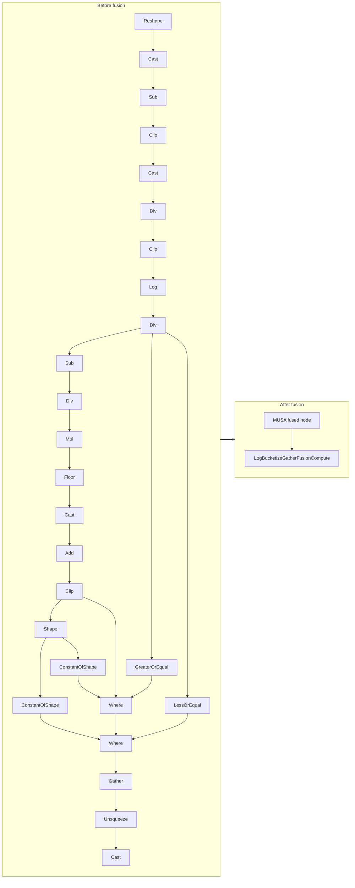

<!-- AUTO-GENERATED by scripts/gen_fusion_docs.py. DO NOT EDIT BY HAND. -->
# Log Bucketize Gather Fusion

This file is generated from the current C++ fusion source and matching fusion tests. The before graph prefers ONNX topology extracted from test cases, then falls back to finder source analysis; no per-fusion prose metadata is maintained by the generator.

## Source Mapping

- GetCapability priority: **16**
- Finder: `FindLogBucketizeGatherFusions`
- Finder implementation: `musa/ep/src/fusion/log_bucketize_gather_fusion_matcher.cc`
- Compile detector: `IsLogBucketizeGatherFusionGraph`
- Runtime factory: `CreateLogBucketizeGatherFusion`
- Runtime compute: `LogBucketizeGatherFusionCompute`
- Runtime implementation: `musa/ep/src/fusion/log_bucketize_gather_fusion.cc`
- `drop_constant_initializers`: `false`
- Before-graph topology source: `test/fusion/test_log_bucketize_gather_fusion.py::_build_model`

## Extracted ONNX Ops

`Cast`, `Unsqueeze`, `Gather`, `Where`, `LessOrEqual`, `GreaterOrEqual`, `Clip`, `Div`, `Log`, `Sub`, `Reshape`, `Add`, `Floor`, `Mul`, `ConstantOfShape`, `Shape`

## Mermaid

