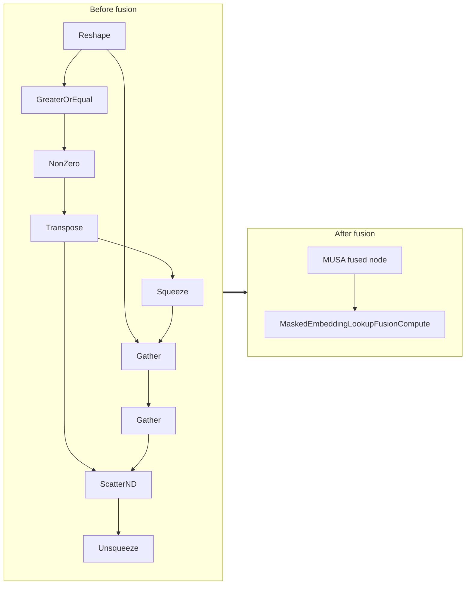

<!-- AUTO-GENERATED by scripts/gen_fusion_docs.py. DO NOT EDIT BY HAND. -->
# Masked Embedding Lookup Fusion

This file is generated from the current C++ fusion source and matching fusion tests. The before graph prefers ONNX topology extracted from test cases, then falls back to finder source analysis; no per-fusion prose metadata is maintained by the generator.

## Source Mapping

- GetCapability priority: **21**
- Finder: `FindMaskedEmbeddingLookupFusions`
- Finder implementation: `musa/ep/src/fusion/masked_embedding_lookup_fusion_matcher.cc`
- Compile detector: `IsMaskedEmbeddingLookupFusionGraph`
- Runtime factory: `CreateMaskedEmbeddingLookupFusion`
- Runtime compute: `MaskedEmbeddingLookupFusionCompute`
- Runtime implementation: `musa/ep/src/fusion/masked_embedding_lookup_fusion.cc`
- `drop_constant_initializers`: `false`
- Before-graph topology source: `test/fusion/test_masked_embedding_lookup_fusion.py::_build_masked_embedding_lookup_model`

## Extracted ONNX Ops

`Unsqueeze`, `ScatterND`, `Transpose`, `Gather`, `Reshape`, `Squeeze`, `NonZero`, `GreaterOrEqual`

## Mermaid

