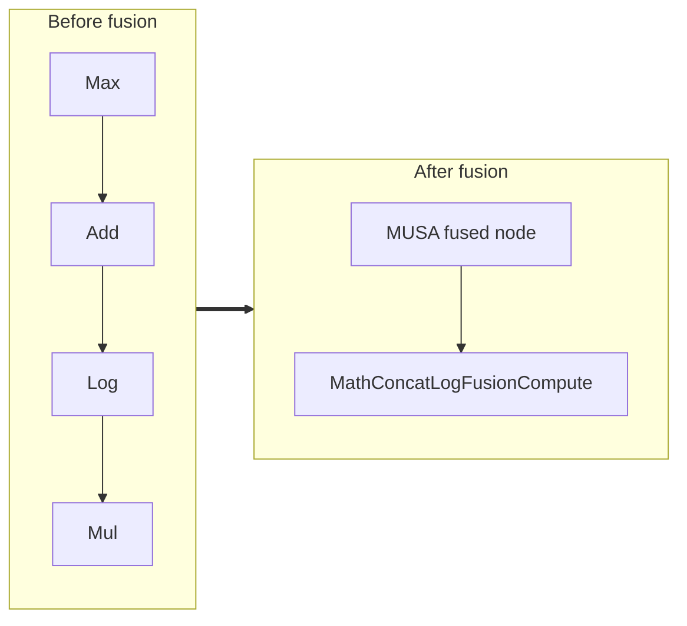

<!-- AUTO-GENERATED by scripts/gen_fusion_docs.py. DO NOT EDIT BY HAND. -->
# Math Concat Log Fusion

This file is generated from the current C++ fusion source and matching fusion tests. The before graph prefers ONNX topology extracted from test cases, then falls back to finder source analysis; no per-fusion prose metadata is maintained by the generator.

## Source Mapping

- GetCapability priority: **17**
- Finder: `FindMathConcatLogFusions`
- Finder implementation: `musa/ep/src/fusion/math_concat_log_fusion_matcher.cc`
- Compile detector: `IsMathConcatLogFusionGraph`
- Runtime factory: `CreateMathConcatLogFusion`
- Runtime compute: `MathConcatLogFusionCompute`
- Runtime implementation: `musa/ep/src/fusion/math_concat_log_fusion.cc`
- `drop_constant_initializers`: `false`
- Before-graph topology source: `test/fusion/test_math_concat_log_fusion.py::_build_math_concat_log_model`

## Extracted ONNX Ops

`Mul`, `Log`, `Add`, `Max`

## Mermaid

