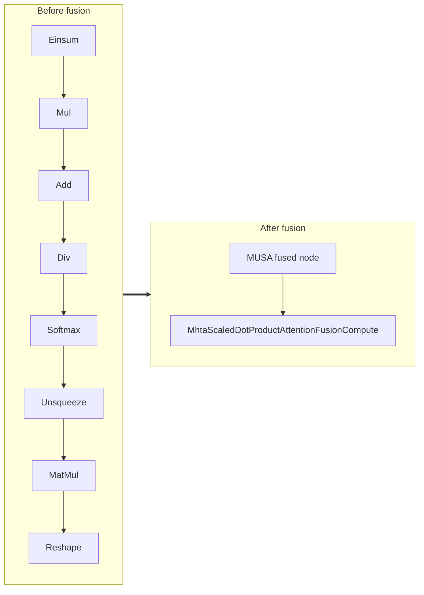

<!-- AUTO-GENERATED by scripts/gen_fusion_docs.py. DO NOT EDIT BY HAND. -->
# Mhta Scaled Dot Product Attention Fusion

This file is generated from the current C++ fusion source and matching fusion tests. The before graph prefers ONNX topology extracted from test cases, then falls back to finder source analysis; no per-fusion prose metadata is maintained by the generator.

## Source Mapping

- GetCapability priority: **1**
- Finder: `FindMhtaScaledDotProductAttentionFusions`
- Finder implementation: `musa/ep/src/fusion/mhta_scaled_dot_product_attention_fusion_matcher.cc`
- Compile detector: `IsMhtaScaledDotProductAttentionFusionGraph`
- Runtime factory: `CreateMhtaScaledDotProductAttentionFusion`
- Runtime compute: `MhtaScaledDotProductAttentionFusionCompute`
- Runtime implementation: `musa/ep/src/fusion/mhta_scaled_dot_product_attention_fusion.cc`
- `drop_constant_initializers`: `false`
- Before-graph topology source: `test/fusion/test_mhta_scaled_dot_product_attention_fusion.py::test_mhta_scaled_dot_product_attention_sim_rank3_div_temperature_fusion`

## Extracted ONNX Ops

`MatMul`, `Softmax`, `Div`, `Add`, `Mul`, `Reshape`, `Unsqueeze`, `Einsum`

## Mermaid

