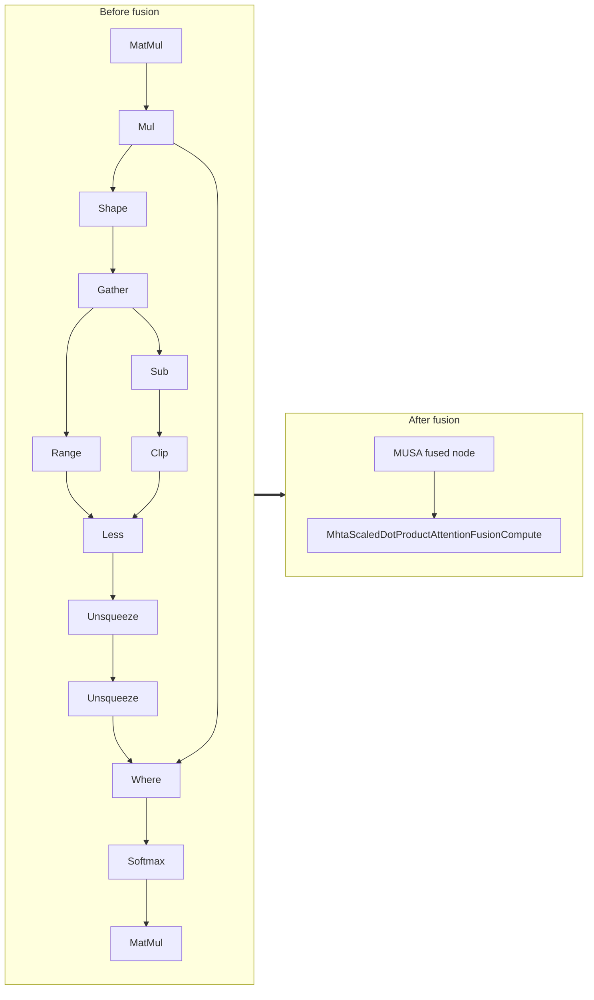

<!-- AUTO-GENERATED by scripts/gen_fusion_docs.py. DO NOT EDIT BY HAND. -->
# Mhta Scaled Dot Product Attention Fusion

This file is generated from the current C++ fusion source and matching fusion tests. The before graph prefers ONNX topology extracted from test cases, then falls back to finder source analysis; no per-fusion prose metadata is maintained by the generator.

## Source Mapping

- GetCapability priority: **3**
- Finder: `FindMhtaScaledDotProductAttentionFusions`
- Finder implementation: `musa/ep/src/fusion/mhta_scaled_dot_product_attention_fusion_matcher.cc`
- Compile detector: `IsMhtaScaledDotProductAttentionFusionGraph`
- Runtime factory: `CreateMhtaScaledDotProductAttentionFusion`
- Runtime compute: `MhtaScaledDotProductAttentionFusionCompute`
- Runtime implementation: `musa/ep/src/fusion/mhta_scaled_dot_product_attention_fusion.cc`
- `drop_constant_initializers`: `false`
- Before-graph topology source: `test/fusion/test_mhta_scaled_dot_product_attention_fusion.py::test_mhta_unirank_lseq_materialized_bool_mask_runmath`

## Extracted ONNX Ops

`MatMul`, `Where`, `Softmax`, `Cast`, `Mul`, `Unsqueeze`, `Less`, `Range`, `Clip`, `Sub`, `Gather`, `Shape`, `Transpose`, `Concat`, `Div`, `Add`, `Reshape`, `Einsum`

## Mermaid

```mermaid
flowchart LR
  subgraph Before[Before fusion]
    B0["MatMul"]
    B1["Mul"]
    B2["Shape"]
    B3["Gather"]
    B4["Sub"]
    B5["Clip"]
    B6["Range"]
    B7["Less"]
    B8["Unsqueeze"]
    B9["Unsqueeze"]
    B10["Where"]
    B11["Softmax"]
    B12["MatMul"]
    B0 --> B1
    B1 --> B2
    B2 --> B3
    B3 --> B4
    B4 --> B5
    B3 --> B6
    B6 --> B7
    B5 --> B7
    B7 --> B8
    B8 --> B9
    B9 --> B10
    B1 --> B10
    B10 --> B11
    B11 --> B12
  end
  subgraph After[After fusion]
    A0["MUSA fused node"]
    A1["MhtaScaledDotProductAttentionFusionCompute"]
    A0 --> A1
  end
  Before ==> After
```
