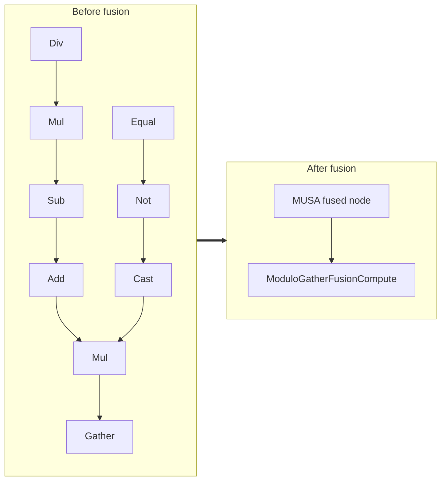

<!-- AUTO-GENERATED by scripts/gen_fusion_docs.py. DO NOT EDIT BY HAND. -->
# Modulo Gather Fusion

This file is generated from the current C++ fusion source and matching fusion tests. The before graph prefers ONNX topology extracted from test cases, then falls back to finder source analysis; no per-fusion prose metadata is maintained by the generator.

## Source Mapping

- GetCapability priority: **17**
- Finder: `FindModuloGatherFusions`
- Finder implementation: `musa/ep/src/fusion/modulo_gather_fusion_matcher.cc`
- Compile detector: `IsModuloGatherFusionGraph`
- Runtime factory: `CreateModuloGatherFusion`
- Runtime compute: `ModuloGatherFusionCompute`
- Runtime implementation: `musa/ep/src/fusion/modulo_gather_fusion.cc`
- `drop_constant_initializers`: `false`
- Before-graph topology source: `test/fusion/test_modulo_gather_fusion.py::_build_modulo_gather_model`

## Extracted ONNX Ops

`Gather`, `Mul`, `Add`, `Cast`, `Sub`, `Div`, `Not`, `Equal`

## Mermaid

