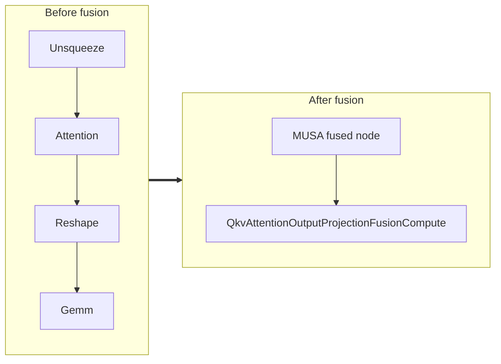

<!-- AUTO-GENERATED by scripts/gen_fusion_docs.py. DO NOT EDIT BY HAND. -->
# Qkv Attention Output Projection Fusion

This file is generated from the current C++ fusion source and matching fusion tests. The before graph prefers ONNX topology extracted from test cases, then falls back to finder source analysis; no per-fusion prose metadata is maintained by the generator.

## Source Mapping

- GetCapability priority: **2**
- Finder: `FindQkvAttentionOutputProjectionFusions`
- Finder implementation: `musa/ep/src/fusion/qkv_attention_output_projection_fusion_matcher.cc`
- Compile detector: `IsQkvAttentionOutputProjectionFusionGraph`
- Runtime factory: `CreateQkvAttentionOutputProjectionFusion`
- Runtime compute: `QkvAttentionOutputProjectionFusionCompute`
- Runtime implementation: `musa/ep/src/fusion/qkv_attention_output_projection_fusion.cc`
- `drop_constant_initializers`: `false`
- Before-graph topology source: `test/fusion/test_qkv_attention_output_projection_fusion.py::test_qkv_attention_output_projection_fuses_four_attention_nodes`

## Extracted ONNX Ops

`Gemm`, `Reshape`, `Unsqueeze`

## Mermaid

