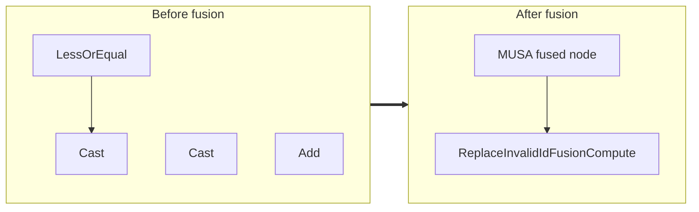

<!-- AUTO-GENERATED by scripts/gen_fusion_docs.py. DO NOT EDIT BY HAND. -->
# Replace Invalid Id Fusion

This file is generated from the current C++ fusion source and matching fusion tests. The before graph prefers ONNX topology extracted from test cases, then falls back to finder source analysis; no per-fusion prose metadata is maintained by the generator.

## Source Mapping

- GetCapability priority: **25**
- Finder: `FindReplaceInvalidIdFusions`
- Finder implementation: `musa/ep/src/fusion/replace_invalid_id_fusion_matcher.cc`
- Compile detector: `IsReplaceInvalidIdFusionGraph`
- Runtime factory: `CreateReplaceInvalidIdFusion`
- Runtime compute: `ReplaceInvalidIdFusionCompute`
- Runtime implementation: `musa/ep/src/fusion/replace_invalid_id_fusion.cc`
- `drop_constant_initializers`: `true`
- Before-graph topology source: `test/fusion/test_replace_invalid_id_fusion.py::_build_replace_invalid_id_model`

## Extracted ONNX Ops

`Add`, `LessOrEqual`

## Mermaid

