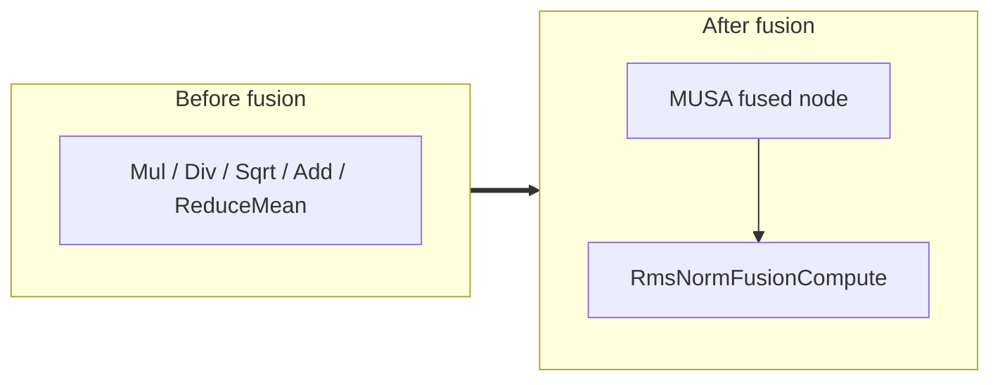

<!-- AUTO-GENERATED by scripts/gen_fusion_docs.py. DO NOT EDIT BY HAND. -->
# Rms + Norm Fusion

This file is generated from the current C++ fusion source. The before graph is derived from ONNX op names found in the finder/detector source; no per-fusion prose metadata is maintained by the generator.

## Source Mapping

- GetCapability priority: **12**
- Finder: `FindRmsNormFusions`
- Compile detector: `IsRmsNormFusionGraph`
- Runtime factory: `CreateRmsNormFusion`
- Runtime compute: `RmsNormFusionCompute`
- Runtime implementation: `musa/ep/src/fusion/rms_norm_fusion.cc`
- `drop_constant_initializers`: `false`

## Extracted ONNX Ops

`Mul`, `Div`, `Sqrt`, `Add`, `ReduceMean`

## Mermaid

