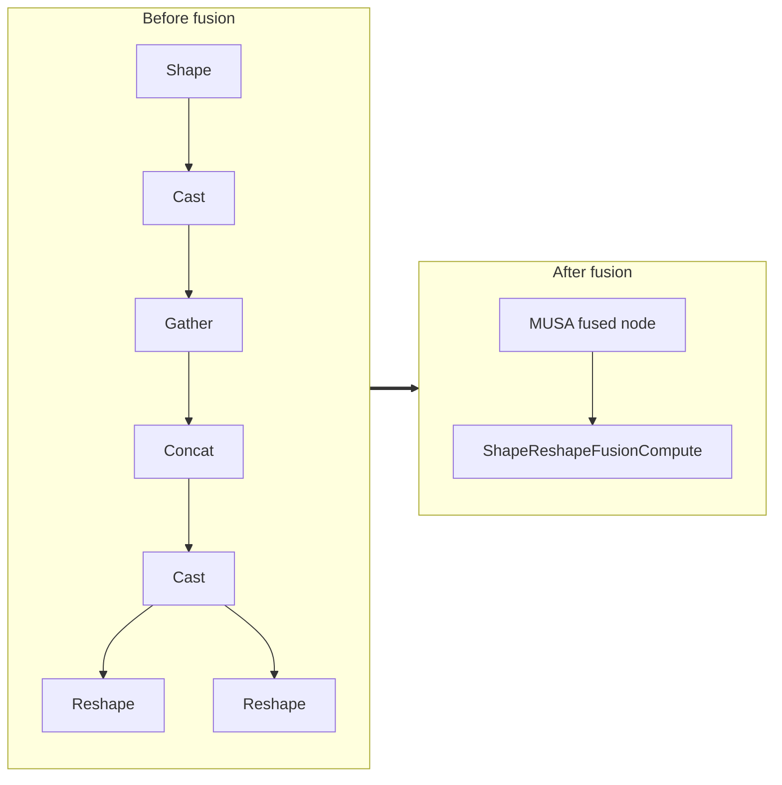

<!-- AUTO-GENERATED by scripts/gen_fusion_docs.py. DO NOT EDIT BY HAND. -->
# Shape Reshape Fusion

This file is generated from the current C++ fusion source and matching fusion tests. The before graph prefers ONNX topology extracted from test cases, then falls back to finder source analysis; no per-fusion prose metadata is maintained by the generator.

## Source Mapping

- GetCapability priority: **10**
- Finder: `FindShapeReshapeFusions`
- Finder implementation: `musa/ep/src/fusion/shape_reshape_fusion_matcher.cc`
- Compile detector: `IsShapeReshapeFusionGraph`
- Runtime factory: `CreateShapeReshapeFusion`
- Runtime compute: `ShapeReshapeFusionCompute`
- Runtime implementation: `musa/ep/src/fusion/shape_reshape_fusion.cc`
- `drop_constant_initializers`: `true`
- Before-graph topology source: `test/fusion/test_shape_reshape_fusion.py::_build_shape_metadata_reshape_model`

## Extracted ONNX Ops

`Gather`, `Cast`, `Shape`, `Concat`, `Reshape`

## Mermaid

