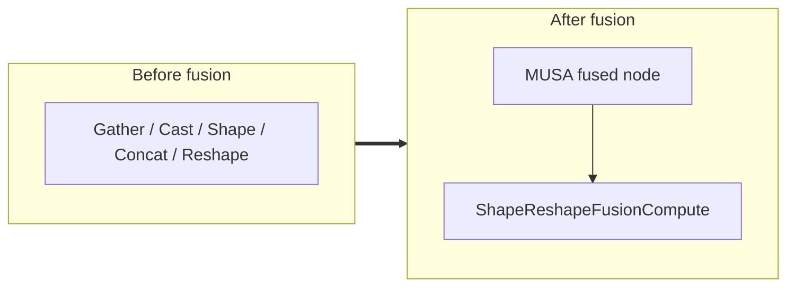

<!-- AUTO-GENERATED by scripts/gen_fusion_docs.py. DO NOT EDIT BY HAND. -->
# Shape + Reshape Fusion

This file is generated from the current C++ fusion source. The before graph is derived from ONNX op names found in the finder/detector source; no per-fusion prose metadata is maintained by the generator.

## Source Mapping

- GetCapability priority: **9**
- Finder: `FindShapeReshapeFusions`
- Compile detector: `IsShapeReshapeFusionGraph`
- Runtime factory: `CreateShapeReshapeFusion`
- Runtime compute: `ShapeReshapeFusionCompute`
- Runtime implementation: `musa/ep/src/fusion/shape_reshape_fusion.cc`
- `drop_constant_initializers`: `true`

## Extracted ONNX Ops

`Gather`, `Cast`, `Shape`, `Concat`, `Reshape`

## Mermaid

