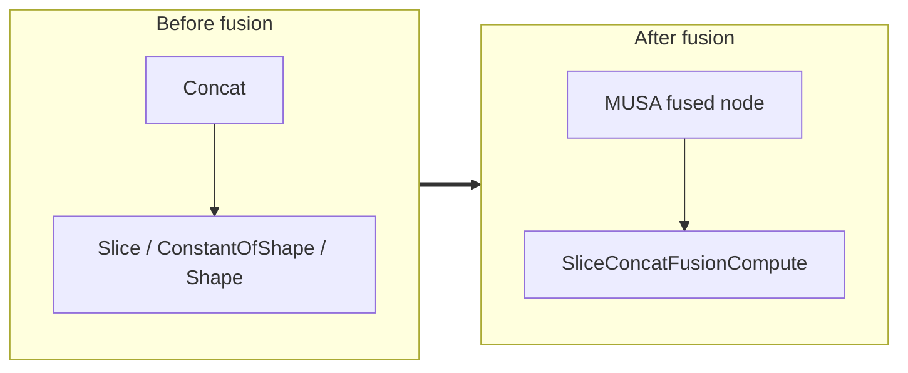

<!-- AUTO-GENERATED by scripts/gen_fusion_docs.py. DO NOT EDIT BY HAND. -->
# Slice + Concat Fusion

This file is generated from the current C++ fusion source. The before graph is derived from ONNX op names found in the finder/detector source; no per-fusion prose metadata is maintained by the generator.

## Source Mapping

- GetCapability priority: **5**
- Finder: `FindSliceConcatFusions`
- Compile detector: `IsSliceConcatFusionGraph`
- Runtime factory: `CreateSliceConcatFusion`
- Runtime compute: `SliceConcatFusionCompute`
- Runtime implementation: `musa/ep/src/fusion/slice_concat_fusion.cc`
- `drop_constant_initializers`: `false`

## Extracted ONNX Ops

`Concat`, `Slice`, `ConstantOfShape`, `Shape`

## Mermaid

