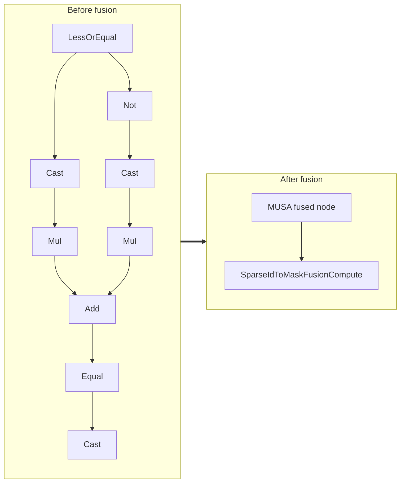

<!-- AUTO-GENERATED by scripts/gen_fusion_docs.py. DO NOT EDIT BY HAND. -->
# Sparse Id To Mask Fusion

This file is generated from the current C++ fusion source and matching fusion tests. The before graph prefers ONNX topology extracted from test cases, then falls back to finder source analysis; no per-fusion prose metadata is maintained by the generator.

## Source Mapping

- GetCapability priority: **20**
- Finder: `FindSparseIdToMaskFusions`
- Finder implementation: `musa/ep/src/fusion/sparse_id_to_mask_fusion_matcher.cc`
- Compile detector: `IsSparseIdToMaskFusionGraph`
- Runtime factory: `CreateSparseIdToMaskFusion`
- Runtime compute: `SparseIdToMaskFusionCompute`
- Runtime implementation: `musa/ep/src/fusion/sparse_id_to_mask_fusion.cc`
- `drop_constant_initializers`: `false`
- Before-graph topology source: `test/fusion/test_sparse_id_to_mask_fusion.py::_build_sparse_id_to_mask_model`

## Extracted ONNX Ops

`Cast`, `Equal`, `Add`, `Mul`, `LessOrEqual`, `Not`

## Mermaid

