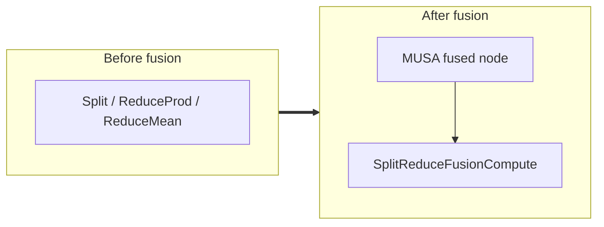

<!-- AUTO-GENERATED by scripts/gen_fusion_docs.py. DO NOT EDIT BY HAND. -->
# Split + Reduce Fusion

This file is generated from the current C++ fusion source. The before graph is derived from ONNX op names found in the finder/detector source; no per-fusion prose metadata is maintained by the generator.

## Source Mapping

- GetCapability priority: **11**
- Finder: `FindSplitReduceFusions`
- Compile detector: `IsSplitReduceFusionGraph`
- Runtime factory: `CreateSplitReduceFusion`
- Runtime compute: `SplitReduceFusionCompute`
- Runtime implementation: `musa/ep/src/fusion/split_reduce_fusion.cc`
- `drop_constant_initializers`: `false`

## Extracted ONNX Ops

`Split`, `ReduceProd`, `ReduceMean`

## Mermaid

