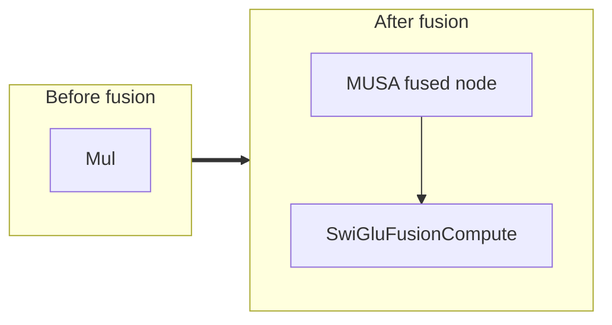

<!-- AUTO-GENERATED by scripts/gen_fusion_docs.py. DO NOT EDIT BY HAND. -->
# Swi Glu Fusion

This file is generated from the current C++ fusion source and matching fusion tests. The before graph prefers ONNX topology extracted from test cases, then falls back to finder source analysis; no per-fusion prose metadata is maintained by the generator.

## Source Mapping

- GetCapability priority: **26**
- Finder: `FindSwiGluFusions`
- Finder implementation: `musa/ep/src/fusion/swiglu_fusion_matcher.cc`
- Compile detector: `IsSwiGluFusionGraph`
- Runtime factory: `CreateSwiGluFusion`
- Runtime compute: `SwiGluFusionCompute`
- Runtime implementation: `musa/ep/src/fusion/swiglu_fusion.cc`
- `drop_constant_initializers`: `true`
- Before-graph topology source: `musa/ep/src/fusion/swiglu_fusion_matcher.cc` finder source

## Extracted ONNX Ops

`Mul`, `Sigmoid`, `MatMul`

## Mermaid

