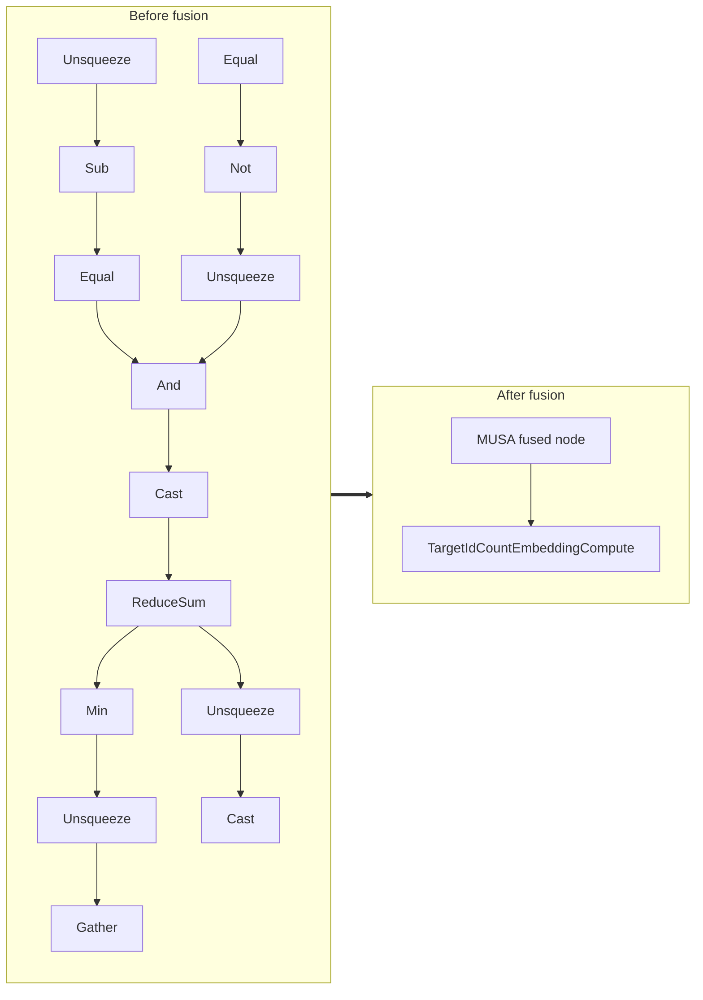

<!-- AUTO-GENERATED by scripts/gen_fusion_docs.py. DO NOT EDIT BY HAND. -->
# Target Id Count Embedding Fusion

This file is generated from the current C++ fusion source and matching fusion tests. The before graph prefers ONNX topology extracted from test cases, then falls back to finder source analysis; no per-fusion prose metadata is maintained by the generator.

## Source Mapping

- GetCapability priority: **22**
- Finder: `FindTargetIdCountEmbeddingFusions`
- Finder implementation: `musa/ep/src/fusion/target_id_count_embedding_fusion_matcher.cc`
- Compile detector: `IsTargetIdCountEmbeddingFusionGraph`
- Runtime factory: `CreateTargetIdCountEmbeddingFusion`
- Runtime compute: `TargetIdCountEmbeddingCompute`
- Runtime implementation: `musa/ep/src/fusion/target_id_count_embedding_fusion.cc`
- `drop_constant_initializers`: `false`
- Before-graph topology source: `test/fusion/test_target_id_count_embedding_fusion.py::_build_model`

## Extracted ONNX Ops

`Gather`, `Unsqueeze`, `Min`, `ReduceSum`, `Cast`, `And`, `Equal`, `Sub`, `Not`

## Mermaid

